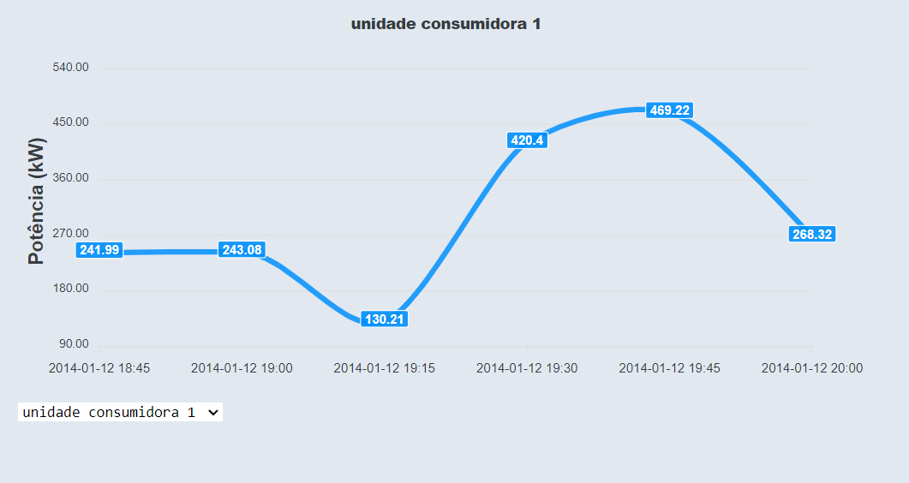

# Trabalho 1 - Redes de Computadores

## Descrição

Este projeto consiste em uma aplicação distribuída simples com base na arquitetura cliente-servidor. O servidor simula a realização de medições de 60 unidades consumidoras de energia e de 1 unidade geradora.

# Funcionalidade

- A cada 0.625 segundos, o servidor atualiza a medição atual.
- Dentro desse intervalo, caso um cliente faça uma requisição buscando medições, o servidor irá enviar as últimas medições lidas.
- O servidor irá bloquear requisições se mais de 10 ou mais clientes estiverem com conexões pendentes durante o momento da requisição
- O cliente fará requisições periódicas e irá armazenar os dados recebidos.
- Os dados serão plotados em um gráfico

# Dashboard



# Servidor

## Exemplo de resposta da requisição de medições (http://localhost:5000/api/)

```json
{
  "consumption_measurements": [
    322.81, 150.03, 1254.98, 1011.95, 425.91, 540.23, 266.85, 1152.79, 192.12,
    468.55, 2751.03, 2179.8, 248.03, 911.95, 61.08, 111.25, 1986.43, 624.67,
    977.81, 893.64, 2123.36, 249.04, 209.11, 844.59, 1446.91, 1373.17, 334.91,
    1068.82, 1561.89, 121.32, 192.2, 421.18, 345.26, 523.29, 988.83, 1485.23,
    1769.92, 360.73, 2849.33, 690.19, 1498.05, 989.31, 307.15, 1879.62, 1846.58,
    201.0, 228.58, 1657.8, 1599.62, 453.8, 1857.92, 787.61, 313.98, 296.8,
    211.11, 501.04, 294.44, 324.56, 1308.19, 332.69
  ],
  "date": "2014-01-18 18:45",
  "generation_measurements": [0.0]
}
```

## Exemplo de resposta para a requisição de listagem de IPs (http://localhost:5000/api/list-ips)

```Json
[
	"127.0.0.1",
	"127.0.0.1"
]
```
